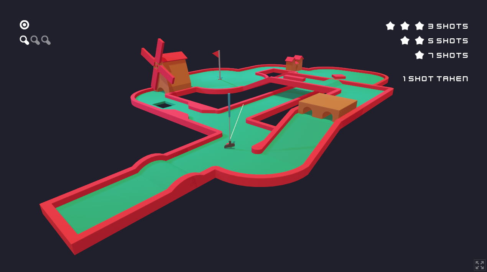

    <h1>
        Golf Jam
         
        
    </h1>
    
    

Golf Jam is a game I originally began to build for the [Kenney Jam 2020](https://itch.io/jam/kenney-jam-2020). Unfortunately, I couldn't finish it in time, but I decided to pick it back up and finish building it under the original rules of the game jam (i.e. to use only assets provided by Kenney).

Controls
--------
**Mouse** - control the direction the camera is facing by moving the mouse
**Tab** - toggle between aim mode and free move mode
**W, A, S, D** - move up, left, down, right in free move mode
**A, D** - move the aim left or right when in aim mode
**Space Bar** - lock in your aim and display the power bar; press again to confirm the power of the shot
**Escape / Delete** - pause the game and open the menu
**CTRL** - toggle the zoom level

License
-------
This project is dual licensed as follows:

- All model and sound files created by Kenney.nl are licensed under [Creative Commons Zero License](https://creativecommons.org/publicdomain/zero/1.0/)
- All source code is licensed under [GNU GPL v3](https://www.gnu.org/licenses/gpl-3.0.en.html)

A copy of the GNU GPL v3 license can be found in [.licenses/gpl-v3.txt](.licenses/gpl-v3.txt).
